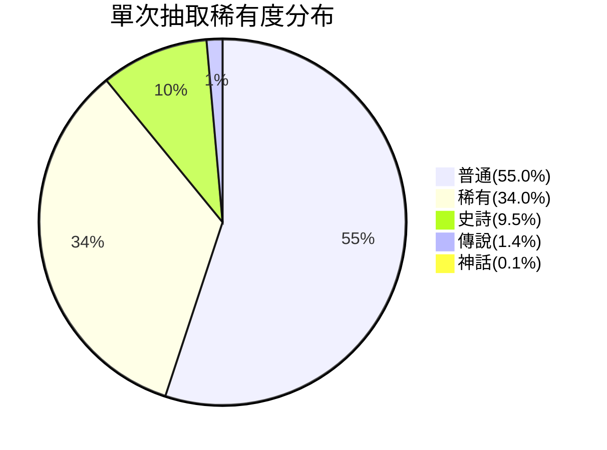
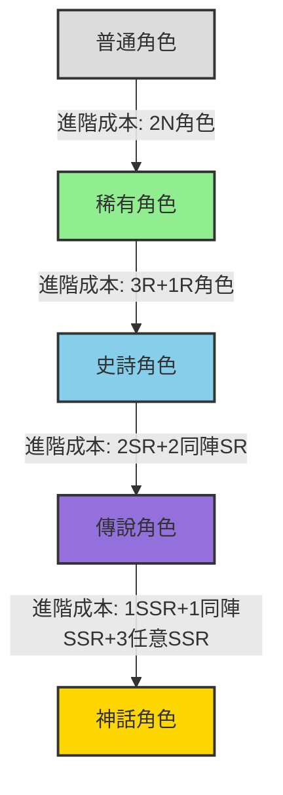
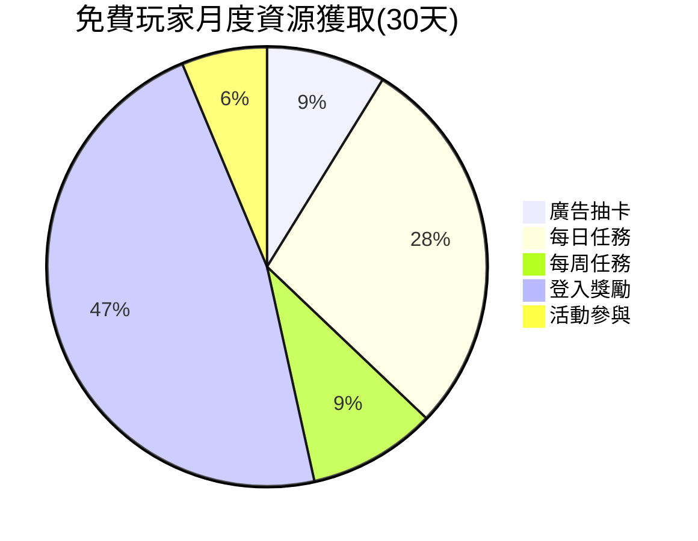
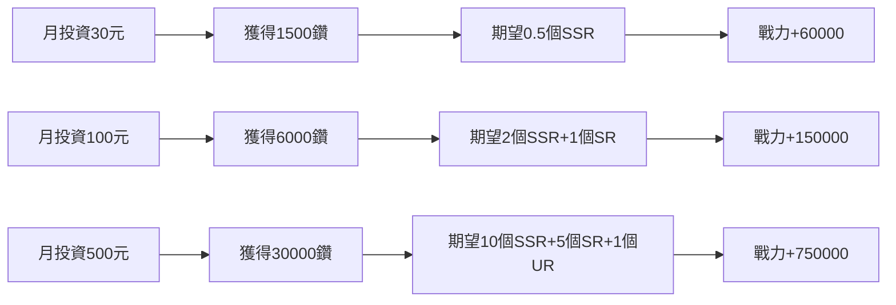
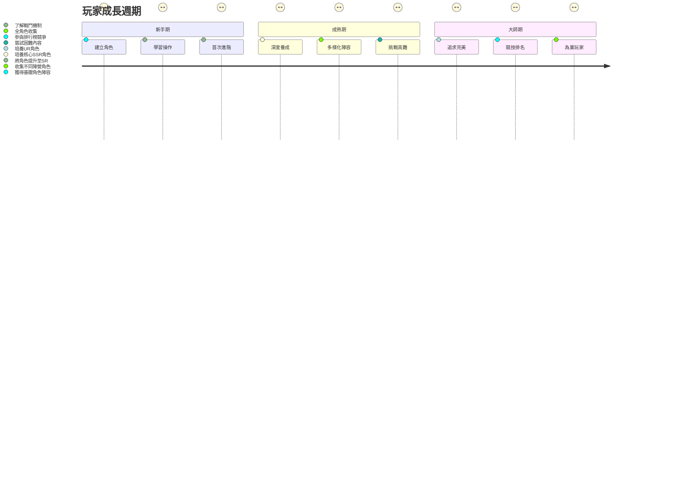
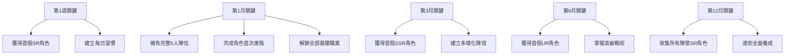
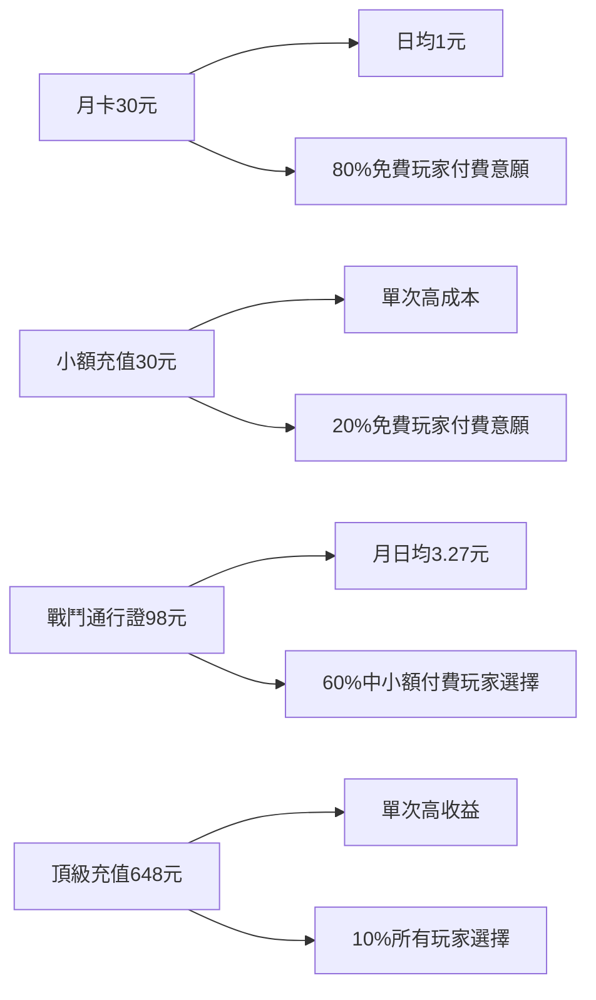
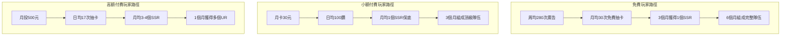

# 角色收益與強度成長圖表分析

## 一、角色抽取機率圖表

### 1.1 基礎抽取機率


### 1.2 十連抽保底機制

```mermaid
gantt
    title 十連抽保底系統
    dateFormat X
    axisFormat %d
    section 保底機制
    無保底      : 10, 20
    SR保底     : 21, 40
    SSR保底    : 41, 80
    UR保底     : 81, 90
```


### 1.3 期望抽取成本對比表
| 稀有度 | 基礎機率 | 期望抽數 | 獎勵廣告次數 | 付費成本(單抽) | 付費成本(十連) |
|--------|----------|----------|--------------|----------------|----------------|
| 普通 | 55.0% | 1.8 | 1-3 | 300鑽 | 2700鑽 |
| 稀有 | 34.0% | 2.9 | 3-6 | 300鑽 | 2700鑽 |
| 史詩 | 9.5% | 10.5 | 10-20 | 300鑽 | 2700鑽 |
| 傳說 | 1.4% | 71.4 | 70-142 | 300鑽 | 2700鑽 |
| 神話 | 0.1% | 1000 | 1000-2000 | 300鑽 | 2700鑽 |

## 二、角色強度成長曲線

### 2.1 數值成長曲線圖


### 2.2 稀有度強度對比圖
```mermaid
bar
    title 各稀有度基礎戰力對比(100級)
    section 生命值
    普通 : 8000
    稀有 : 12000
    史詩 : 20000
    傳說 : 32000
    神話 : 50000
    section 攻擊力
    普通 : 800
    稀有 : 1200
    史詩 : 2000
    傳說 : 3200
    神話 : 5000
    section 防禦力
    普通 : 400
    稀有 : 600
    史詩 : 1000
    傳說 : 1600
    神話 : 2500
    section 綜合戰力
    普通 : 12000
    稀有 : 19800
    史詩 : 33000
    傳說 : 52800
    神話 : 82500
```

### 2.3 角色進階效果圖


## 三、經濟模型分析

### 3.1 免費玩家月度收益預估


### 3.2 付費玩家收益對比圖
```mermaid
bar
    title 不同付费層級月度收益對比
    section 每日鑽石
    免費玩家 : 30
    小額付費 : 300
    中額付費 : 900
    高額付費 : 3000
    section 每月高級角色
    免費玩家 : 0.2
    小額付費 : 1.5
    中額付費 : 4
    高額付費 : 10
    section 綜合戰力
    免費玩家 : 52000
    小額付費 : 180000
    中額付費 : 480000
    高額付費 : 1200000
```

### 3.3 投資回報率分析


## 四、玩法循環分析

### 4.1 玩家成長週期


### 4.2 長期留存關鍵點


## 五、付費設計分析

### 5.1 廣告收益效率表
| 廣告類型 | 玩家時長成本 | 實際收益成本 | 公司收益 | 效率評分 |
|----------|--------------|------------|---------|---------|
| 激勵廣告 | 30秒觀看 | 0.05元/次抽 | 0.03元 | ⭐⭐⭐⭐⭐ |
| 抽卡廣告 | 30秒觀看 | 0.05元/次抽 | 0.03元 | ⭐⭐⭐⭐ |
| 加倍廣告 | 45秒觀看 | 0.06元/次抽 | 0.04元 | ⭐⭐⭐ |
| 限時廣告 | 60秒觀看 | 0.50元/十連抽 | 0.30元 | ⭐⭐ |

### 5.2 付費點設計合理性


## 六、角色強度表格匯總

### 6.1 各稀有度角色滿級數值表（180級）
| 稀有度 | 生命值 | 攻擊力 | 防禦力 | 速度 | 暴擊率 | 暴擊傷害 | 被動效果 | 主動技能傷害 |
|--------|--------|--------|--------|------|--------|----------|----------|------------|
| 普通 | 14,400 | 1,440 | 720 | 180 | 5.0% | 150% | 無 | 200% |
| 稀有 | 21,600 | 2,160 | 1,080 | 198 | 8.0% | 160% | 1個 | 220% |
| 史詩 | 36,000 | 3,600 | 1,800 | 216 | 10.5% | 175% | 2個 | 250% |
| 傳說 | 57,600 | 5,760 | 2,880 | 234 | 13.5% | 185% | 3個 | 280% |
| 神話 | 90,000 | 9,000 | 4,500 | 252 | 20.0% | 200% | 4個 | 350% |

### 6.2 角色養成成本回報表
| 養成階段 | 時間投入 | 成本消耗(次) | 戰力提升 | 成本效益比 | 推薦策略 |
|----------|----------|------------|----------|-----------|----------|
| 初期(Lv1-40) | 7天 | 10次抽卡/5萬金幣 | 低速提升 | 1:10 | 任務優先 |
| 中期(Lv41-80) | 15天 | 30次抽卡/20萬金幣 | 中速提升 | 1:5 | 廣告抽卡 |
| 高期(Lv81-120) | 30天 | 80次抽卡/50萬金幣 | 快速提升 | 1:2 | 付費抽卡 |
| 頂期(Lv121-180) | 60天 | 200次抽卡/200萬金幣 | 高速提升 | 1:1 | 混合策略 |

### 6.3 不同玩家類型發展路徑


## 七、平衡性建議

### 7.1 數值平衡原則
1. **每提高一稀有度，戰力提升約50-80%**
2. **相同稀有度內，不同角色間戰力差距不超過15%**
3. **培養難度與稀有度成正比，但下游玩家人人有趕上可能性**
4. **免費玩家通過時間投入可達到付費玩家的70%戰力水平**

### 7.2 經濟平衡建議
1. **輕度付費玩家(30元/月)應佔玩家總數的50%以上**
2. **中度付費玩家(100-300元/月)佔比控制在30%左右**
3. **高度付費玩家(300元以上/月)佔比控制在15%以下**
4. **廣告收益應能支持免費玩家獲得基礎遊戲體驗**

---

## 總結

這份圖表分析展示了角色收益系統與強度成長的多維度關係，核心重點包括：

1. **漸進式成長**：玩家可通過多種途徑獲取與強化角色
2. **多元收益機制**：平衡免費觀看廣告、付費獲取與活動參與
3. **長期留存設計**：提供明確的階段目標與成就感
4. **經濟可持續性**：廣告收益與付費內容形成良性循環

通過這些數值和機制設計，可以實現免費玩家有良好的基本體驗，付費玩家有明確的成長目標，同時確保遊戲長期健康發展。